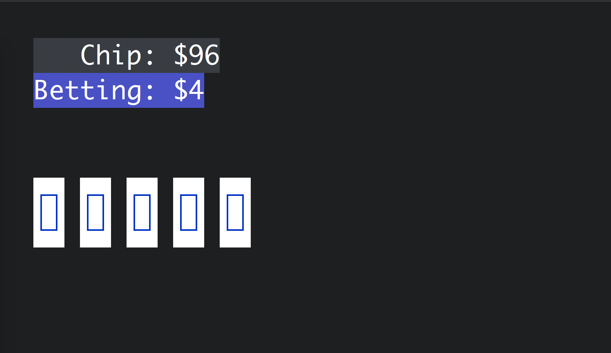
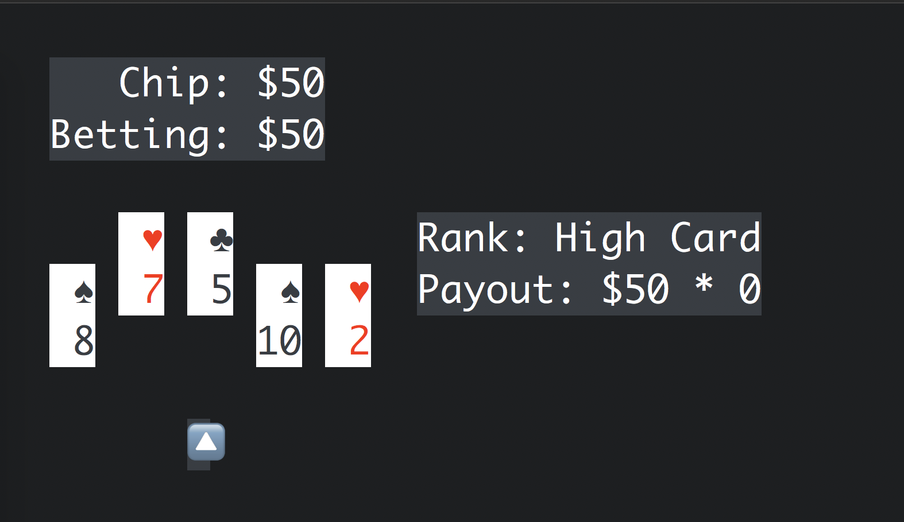
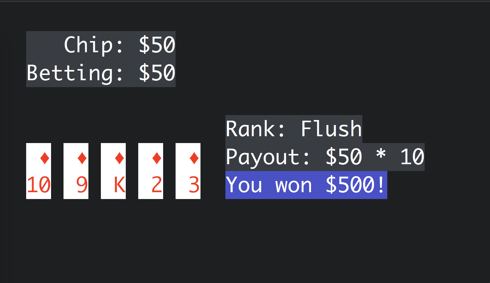

# term_poker
Draw Poker on Terminal

## Requirement
* `Ruby`
* `term_canvas` https://github.com/kthatoto/term_canvas

## Installation
    $ gem install term_canvas
    $ git clone git@github.com:kthatoto/term_poker.git

## Getting Started
    $ ruby term_poker/main.rb

### Quit
|key|action|
|---|---|
|`q`|Quit game|

### Betting

|key|action|
|---|---|
|`k`|Up bet $1|
|`K`|Up bet $5|
|`j`|Down bet $1|
|`J`|Down bet $5|
|`h`|Bet half of total|
|`m`|Bet all|
|`0`|Cancel betting|
|`Enter`|Decide bet and Start to play|

### Playing
The cards which has been raised are going to change.  
The change is only once.

|key|action|
|---|---|
|`h`|Move cursor to left|
|`l`|Move cursor to right|
|`Space`|Toggle the card at the cursor position to change|
|`Enter`|Change the cards|

### Result

|key|action|
|---|---|
|`Enter`|Get payout and return to betting|
